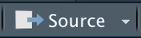

# Quick Start

## Formatting Data

First, make sure that the input data has these required columns

| ID                         | GROUP                                          | TREATMENT | TIMEPOINT                                                                                   |
| -------------------------- | ---------------------------------------------- | --------- | ------------------------------------------------------------------------------------------- |
| Participant Identification | Group (experimental, control, etc.) Identifier | Stim      | In studies without a timepoint, create a TIMEPOINT column and fill it with a constant value |

* The names of the columns can be different than the ones shown here, but the data has to be present

With the data:

1. Export it as a .csv
2. Place your .csv into the `data` folder of this repository

## Set up RStudio

1. Open `lplex_analysis.Rproj` from this repository in RStudio
2. Install the required packages if you don't have them using the following commands in the R console of RStudio:

```r
# These may take a while to download

# Run this first
install.packages(c("tidyverse", "tibble", "scales", "ggfortify", "devtools", "cluster", "crayon", "glue"))

# Run this second
library(devtools)

# Run this third
devtools::install_github("ricardo-bion/ggradar", dependencies = TRUE)
devtools::install_github("jokergoo/ComplexHeatmap")
```

## Set the Settings

* In the file pane of RStudio, open `scripts`, and then open `00_settings.R`

#### COLUMN NAMES

* Set the required column names to the names of the columns in your data

#### COLUMN INDEXES

* Set `lplex_data_columns` to the indexes/column numbers (in vector form) for your analyte columns

```
e.g.
lplex_data_columns <- c(3:6) # = columns 3, 4, 5, and 6
lplex_data_columns <- c(3, 4, 5, 6) # = columns 3, 4, 5, and 6
```

* Do the same thing for `lplex_metadata_columns` for metadata columns (optional)

## Run the Scripts

* Run the files in the `scripts` folder of this repository in the order they are numbered with `source` in the editor pane of RStudio (Dont forget `00_settings.R`!)



## Find the output

* Data is exported by the project into the `output` folder of this repository
* `filtered_data` contains .csv files with cleaned data
* `plot_x` folders contain the different plots, and their numbering scheme can be found in the guide

## Error Handling

#### If you encounter any errors, follow these steps:

1. Make sure your `00_settings.R` file is set **and saved** correctly, and you selected the right file in `03_dataclean.R`
2. Paste `rm(list = ls())` into your R console to remove all variables
3. In the menu bar, click `Session > Restart R`
4. Run all the files in order again, starting from the beginning
